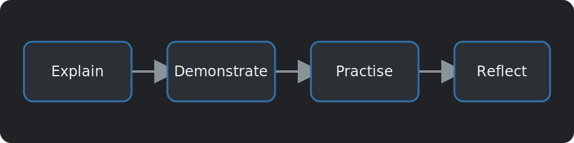

# Guided Workshop Template

This page can be used for a normal workshop where we explain a topic, show an example, and then give everyone something to try.

> [!INFO] What are we doing?
> Add a short description of what we will make, inspect, or learn on this page.

## Overview

Start with a short explanation of **[topic name]**.

It can help to explain where we might see it, why it is useful, or why we should care about it before getting into the technical details.

## What We Will Learn

In this section we will learn to:

- Explain **[main idea]**.
- Find **[main idea]** in an example.
- Use **[tool or technique]** to complete a small task.

## How It Works

Add the background information we need before starting the activity.

### Main Idea

Explain the most important part with a small example.

> [!TIP]
> If a new word or idea is introduced, it is normally easier to show what it does straight away.

## Example

Code can be added using three backticks. Adding the language after the first three backticks will give us syntax highlighting.

```rust
fn describe_topic(topic: &str) -> String {
    format!("Today we are learning about {topic}.")
}

fn main() {
    println!("{}", describe_topic("[topic name]"));
}
```

We can show terminal commands in their own block:

```bash
cargo run
```

If there is an expected result, we can also show it:

```text
Today we are learning about [topic name].
```

## Adding an Image

Images should be placed inside `src/images/`.

They can then be added to a page like this:

```markdown

```

This is what the example image looks like:


## Activity

1. Open **[tool, file, or website]**.
2. Find **[thing we want to inspect]**.
3. Change **[one value or setting]**.
4. Run the example again.
5. Compare the new result with the old one.

> [!WARNING]
> Add any common errors or unsafe commands here so people see them before starting.

## Checkpoint

Before moving on, try to answer:

- What did the example do?
- What changed when we changed the input?
- What do you think would happen if we used **[different input]**?

## Task

> [!SUCCESS] Try it yourself
> Add the main task for this page here.

For example:

1. Change **[part of the example]**.
2. Run it again.
3. Write down or explain what changed.

## Extra Task

If you finish early, try one of these:

- Add support for **[another case]**.
- Try the example with **[different input]**.
- Make a second example using the same idea.
